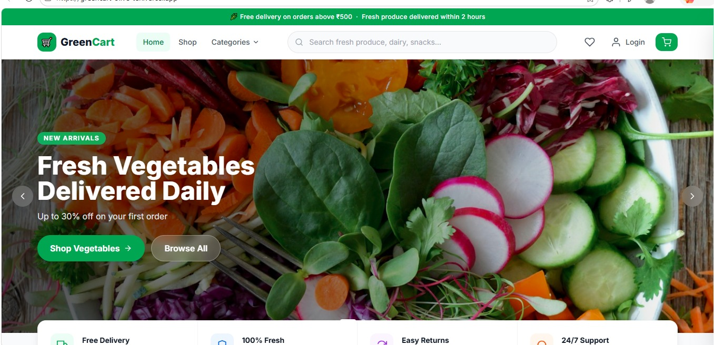
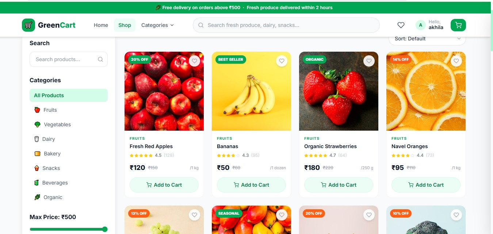
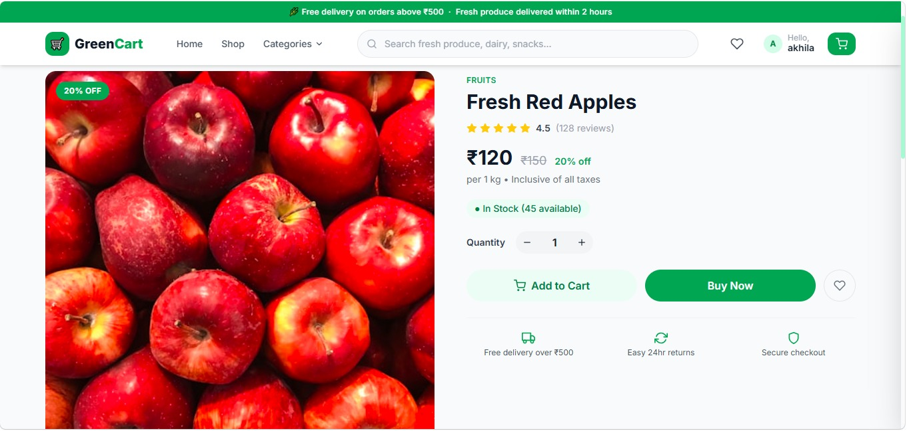
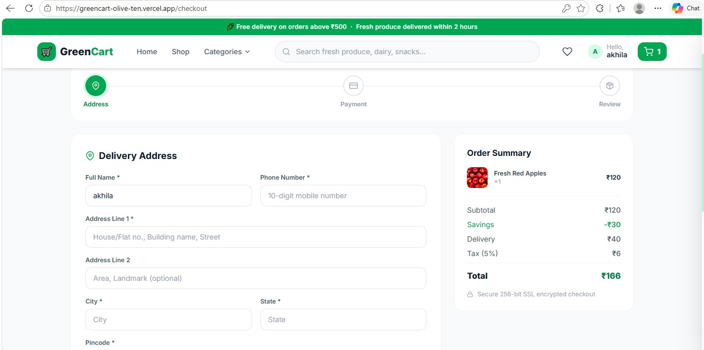
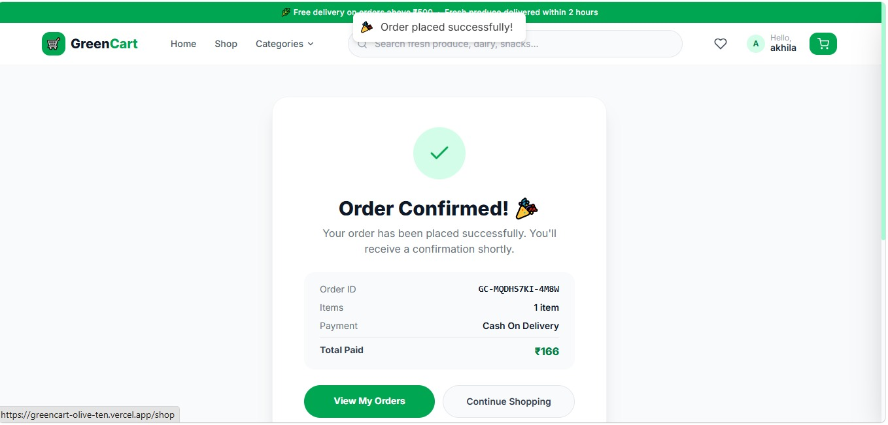
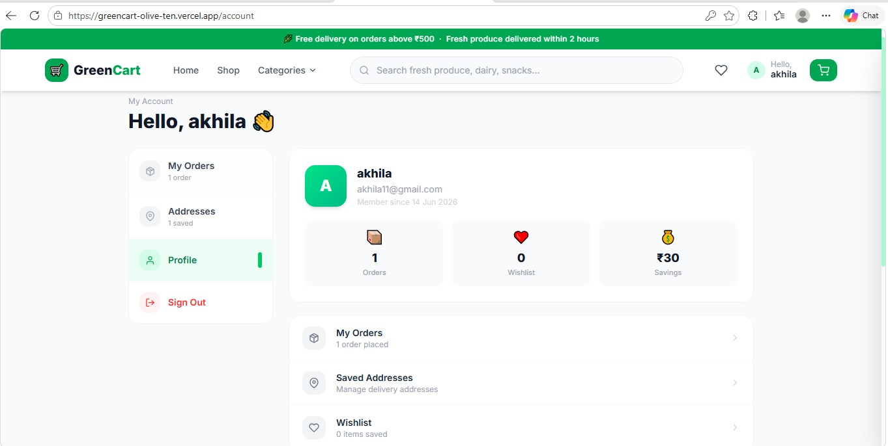

# 🛒 GreenCart – Grocery E-Commerce Web Application

🚀 **Live Demo:** https://greencart-olive-ten.vercel.app/

💻 **GitHub Repository:** https://github.com/Akhila-Palagani24/greencart

---

## 📌 Overview

GreenCart is a modern grocery e-commerce web application built using React.js, Context API, React Router, and Tailwind CSS. The platform enables users to browse products, search items, manage their cart and wishlist, complete checkout, manage addresses, and view order history through a responsive and user-friendly interface.

---

## ✨ Features

### 🏠 Home Page

* Modern responsive homepage
* Hero banner with promotional offers
* Featured product sections
* Category browsing

### 🛍 Shopping Experience

* Product listing page
* Category-based filtering
* Product search functionality
* Product detail page
* Related product suggestions

### 🛒 Cart & Wishlist

* Add products to cart
* Quantity management
* Remove products from cart
* Wishlist functionality
* Local storage persistence

### 📦 Checkout System

* Multi-step checkout process
* Order review page
* Address management
* Payment method selection
* Order confirmation screen

### 👤 User Account

* Login and signup interface
* Profile management
* Saved addresses
* Order history tracking

### 📱 Responsive Design

* Mobile-friendly layout
* Tablet support
* Desktop optimized UI

---

## 📸 Application Screenshots

### 🏠 Home Page



### 🛍 Products Page



### 📋 Review Order


### 💳 Checkout



### 💰 Payment



### ✅ Order Confirmation



### 👤 User Profile



### 📦 Orders History


---

## 🛠 Tech Stack

### Frontend

* React 18
* React Router DOM
* Context API
* Tailwind CSS
* React Hot Toast
* React Icons

### Deployment & Tools

* GitHub
* Vercel
* LocalStorage

---

## 📁 Project Structure

```text
src/
├── components/
│   ├── cart/
│   ├── checkout/
│   ├── home/
│   ├── layout/
│   └── product/
├── context/
│   └── AppContext.jsx
├── data/
│   └── products.js
├── pages/
├── App.jsx
├── index.js
└── index.css
```

## 🚀 Installation

Clone the repository:

```bash
git clone https://github.com/Akhila-Palagani24/greencart.git
```

Install dependencies:

```bash
npm install
```

Run the project locally:

```bash
npm start
```

Build for production:

```bash
npm run build
```

---

## 🌐 Live Deployment

The application is deployed on Vercel:

https://greencart-olive-ten.vercel.app/

---

## 🎯 Future Enhancements

* Node.js + Express Backend
* MongoDB Database Integration
* JWT Authentication
* Razorpay Payment Gateway
* Real Order Tracking
* Admin Dashboard
* Product Reviews & Ratings
* Email Notifications

---

## 👩‍💻 Developer

**Akhila Palagani**

Computer Science Undergraduate passionate about Full Stack Development, React.js, AI Applications, and Software Engineering.

🔗 GitHub: https://github.com/Akhila-Palagani24

---

## ⭐ Support

If you found this project useful, please consider giving it a ⭐ on GitHub.
